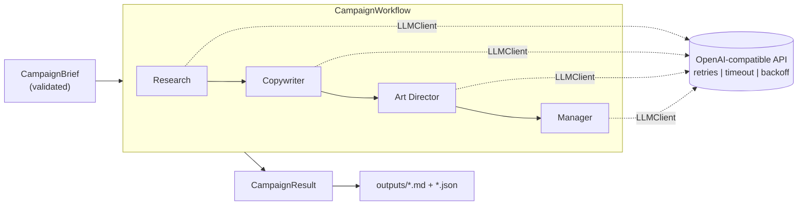

# Campaign Forge

**A production-grade, multi-agent workflow that turns a one-line product brief into a complete, ready-to-hand-off marketing campaign.**

[](https://github.com/syed-waleed-ahmed/multi_agent_workflow/actions/workflows/ci.yml)
[](https://www.python.org/)
[](https://github.com/astral-sh/ruff)
[](http://mypy-lang.org/)
[](#testing)
[](LICENSE)

Campaign Forge coordinates four specialised AI agents, each owning one stage of the pipeline, exactly like a real marketing team:

| Agent | Responsibility | Output |
| --- | --- | --- |
| Research | Audience insights, pain points, trends, positioning angles | Markdown summary |
| Copywriter | Tagline, primary message, headlines, body copy, CTA | Validated structured JSON |
| Art Director | 3-5 image-generation prompts (DALL-E / Stable Diffusion) | List of prompts |
| Manager | Synthesises everything into a polished campaign brief | Markdown document |

It runs on any **OpenAI-compatible** endpoint and defaults to [Groq](https://groq.com) (fast, free-tier friendly).

> This started as a learning exercise and was re-engineered into a small, dependency-light standalone application you can drop into a larger system: typed models, validated I/O, resilient API calls, concurrent batch processing, a real CLI, and a full test suite. See [`docs/ARCHITECTURE.md`](docs/ARCHITECTURE.md) for the high-level design.

---

## Table of contents

- [Why it is production-ready](#why-it-is-production-ready)
- [Architecture](#architecture)
- [Project structure](#project-structure)
- [Installation](#installation)
- [Configuration](#configuration)
- [Usage](#usage)
- [Output](#output)
- [Development](#development)
- [Testing](#testing)
- [Security](#security)
- [Roadmap](#roadmap)
- [Contributing](#contributing)
- [License](#license)

---

## Why it is production-ready

- **Multi-agent orchestration** built on a shared `BaseAgent` abstraction, so adding or swapping a stage is a small, local change.
- **Built for scale.** `run_batch()` fans many briefs across a thread pool with **per-item error isolation**: one failing brief never aborts the batch, and results are returned in input order.
- **Resilient by default.** Automatic retries with exponential backoff and jitter on transient API errors (rate limits, timeouts, 5xx), a hard per-request timeout, and fast-fail on permanent errors. The backoff also honours a server `Retry-After` hint.
- **Typed and validated end-to-end.** [Pydantic](https://docs.pydantic.dev/) models validate every input and every structured model output; malformed data is rejected at the boundary rather than propagating.
- **Import-safe.** No side effects at import time, so the package is safe to embed as a library. Configuration is lazy and comes from environment variables or a `.env` file.
- **Fully typed and linted.** `mypy --strict` and `ruff` pass cleanly; the package ships a `py.typed` marker.
- **Tested without a network.** The suite is fully mocked (no API key, no calls) and covers retries, batch isolation, output validation, and the CLI. Continuous integration runs the same gates on Python 3.10-3.12.

---

## Architecture



Each agent transforms the accumulated context and passes it to the next. Every model call goes through a single `LLMClient` that centralises resilience and logging. The full high-level design - components, data flow, concurrency model, resilience strategy, and extension points - is documented in [`docs/ARCHITECTURE.md`](docs/ARCHITECTURE.md).

---

## Project structure

```text
multi_agent_workflow/
  main.py                      # backwards-compatible entry point (delegates to CLI)
  pyproject.toml               # packaging, dependencies, tool configuration
  examples/batch_campaigns.json
  docs/ARCHITECTURE.md         # high-level design
  src/campaign_forge/
    cli.py                     # argparse CLI: `run` and `batch` subcommands
    config.py                  # pydantic-settings configuration (env / .env driven)
    models.py                  # CampaignBrief, CopyContent, CampaignResult
    llm.py                     # resilient LLM client (retries, timeout, backoff)
    parsing.py                 # lenient JSON / list recovery from raw model text
    workflow.py                # CampaignWorkflow.run() + concurrent run_batch()
    loaders.py                 # load and validate briefs from JSON
    logging_config.py          # structured logging to stderr
    exceptions.py              # typed exception hierarchy
    agents/
      base.py                  # BaseAgent abstraction
      research.py  copywriter.py  art_director.py  manager.py
  tests/                       # fully mocked pytest suite
```

---

## Installation

Requires **Python 3.10+**.

```bash
git clone https://github.com/syed-waleed-ahmed/multi_agent_workflow.git
cd multi_agent_workflow

python -m venv .venv
source .venv/bin/activate          # Windows: .venv\Scripts\activate

pip install -e .                   # or: pip install -r requirements.txt
```

For development (linters, type-checker, tests):

```bash
pip install -e ".[dev]"
```

---

## Configuration

Copy the example environment file and add your key:

```bash
cp .env.example .env
```

```dotenv
GROQ_API_KEY=your-groq-api-key-here
```

Every other setting is optional and overrides a sensible default. Provider-agnostic settings use the `CF_` prefix; the API keys keep their conventional names.

| Variable | Default | Description |
| --- | --- | --- |
| `GROQ_API_KEY` / `OPENAI_API_KEY` | (required) | API key; one of the two must be set |
| `CF_BASE_URL` | `https://api.groq.com/openai/v1` | OpenAI-compatible endpoint |
| `CF_MODEL` | `llama-3.1-8b-instant` | Model used by every agent |
| `CF_TEMPERATURE` | `0.5` | Sampling temperature (0.0-2.0) |
| `CF_MAX_TOKENS` | `800` | Max tokens per response |
| `CF_REQUEST_TIMEOUT` | `60` | Per-request timeout, seconds |
| `CF_MAX_RETRIES` | `4` | Retries on transient API errors |
| `CF_MAX_WORKERS` | `4` | Concurrent campaigns in batch mode |
| `CF_OUTPUT_DIR` | `outputs` | Directory where briefs are saved |
| `CF_LOG_LEVEL` | `INFO` | `DEBUG`, `INFO`, `WARNING`, `ERROR` |

---

## Usage

### Single campaign (interactive)

```bash
campaign-forge            # prompts for each field
```

### Single campaign (flags)

```bash
campaign-forge run \
  --product-name "EcoSip Reusable Bottle" \
  --description "Insulated bottle that keeps drinks cold for 24 hours" \
  --audience "eco-conscious young professionals" \
  --goal "drive summer sales" \
  --tone "fresh, energetic, eco-friendly" \
  --channels "instagram, tiktok, email"
```

The final brief is rendered in the terminal and saved to `outputs/` as **Markdown and JSON**. Add `--json` for machine-readable output on stdout, or `--no-save` to skip writing files.

### Batch mode (concurrent)

Process many briefs from a JSON file (see [`examples/batch_campaigns.json`](examples/batch_campaigns.json)):

```bash
campaign-forge batch examples/batch_campaigns.json --workers 8
```

Each brief runs in isolation. Failures are reported per item and the process exits non-zero if any brief fails, which makes it safe to use in automation and CI.

You can also run without installing via `python -m campaign_forge ...` or the legacy `python main.py ...`.

### As a library

```python
from campaign_forge import CampaignBrief, CampaignWorkflow

brief = CampaignBrief(
    product_name="EcoSip Bottle",
    product_description="Insulated bottle that keeps drinks cold for 24h.",
    target_audience="eco-conscious young professionals",
    goal="drive summer sales",
    tone="fresh and energetic",
    channels=["instagram", "email"],   # or a string: "instagram, email"
)

result = CampaignWorkflow().run(brief)
print(result.final_brief)              # Markdown
print(result.marketing_copy.tagline)  # structured, validated copy
result.save("outputs")                 # writes .md + .json
```

Concurrent batch:

```python
from campaign_forge import CampaignWorkflow, load_briefs

briefs = load_briefs("examples/batch_campaigns.json")
results = CampaignWorkflow().run_batch(briefs, max_workers=8)

for item in results:
    if item.ok:
        item.result.save("outputs")
    else:
        print(f"{item.brief.product_name} failed: {item.error}")
```

---

## Output

Every successful run produces two artifacts in the output directory:

- `<timestamp>_<product-slug>.md` - a self-contained brief with a metadata header, the final campaign brief, and appendices (research summary, structured copy, image prompts).
- `<timestamp>_<product-slug>.json` - the complete `CampaignResult` for programmatic use.

---

## Development

```bash
pip install -e ".[dev]"

ruff check .            # lint
ruff format .           # format
mypy src                # strict type-check
pytest                  # tests
pre-commit install      # optional: run all checks on every commit
```

See [`CONTRIBUTING.md`](CONTRIBUTING.md) for coding standards and the pull-request workflow.

---

## Testing

The test suite is **fully mocked**: it needs no API key and makes no network calls, exercising retries, batch error isolation, output validation, parsing, configuration, and the CLI.

```bash
pytest --cov=campaign_forge --cov-report=term-missing
```

Continuous integration runs `ruff`, `ruff format --check`, `mypy src`, and `pytest` (with a 90% coverage floor) on Python 3.10, 3.11, and 3.12.

---

## Security

- Secrets are read from environment variables or a local `.env` file, which is git-ignored. Never commit real keys; `.env.example` documents the variables with placeholders.
- The package makes no network calls at import time and only contacts the configured `CF_BASE_URL`.
- Model output is validated before use; malformed responses raise typed errors instead of propagating unchecked data.

---

## Roadmap

- Pluggable agents and a configurable pipeline definition
- Async LLM client for higher batch throughput
- Optional PDF export of the final brief
- Streamlit / Gradio web UI
- Automatic image generation from the art-director prompts

---

## Contributing

Contributions are welcome. Please read [`CONTRIBUTING.md`](CONTRIBUTING.md) and open an issue to discuss significant changes before submitting a pull request.

---

## License

Released under the [MIT License](LICENSE).

## Author

Created by **Syed Waleed Ahmed**. If you find this useful, a star on the repository is appreciated.
