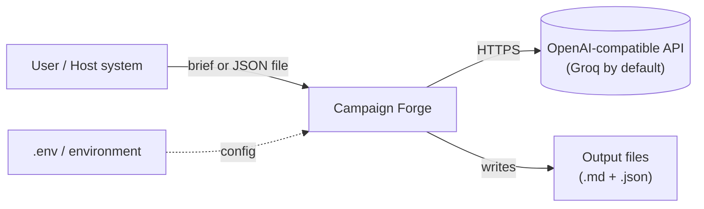
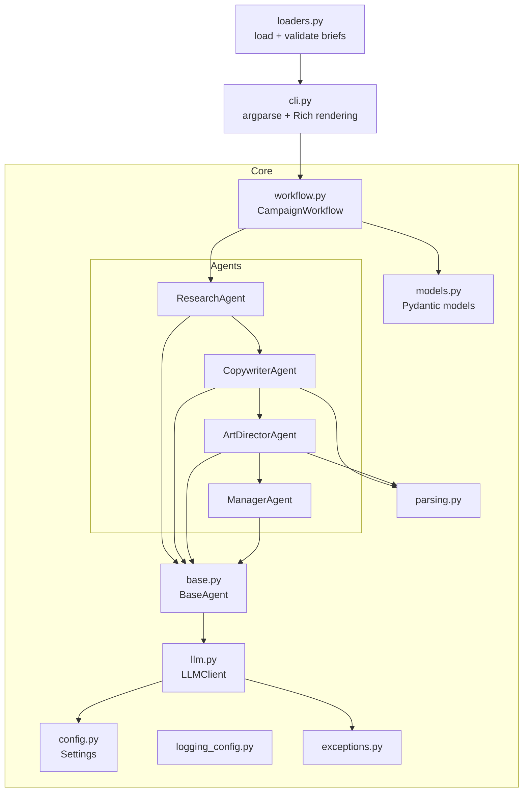
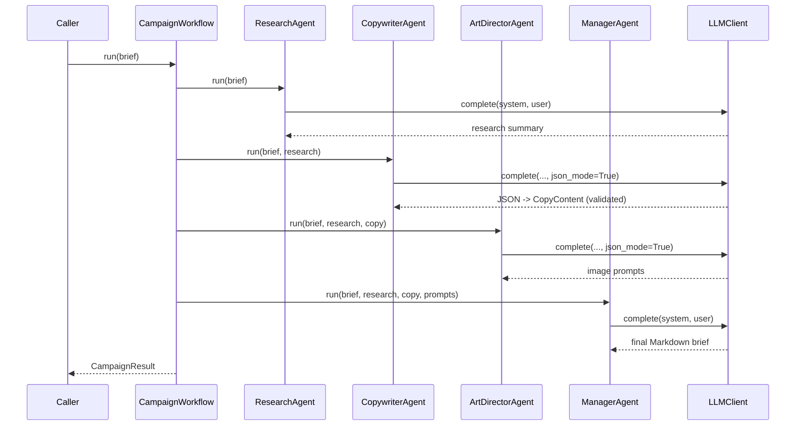
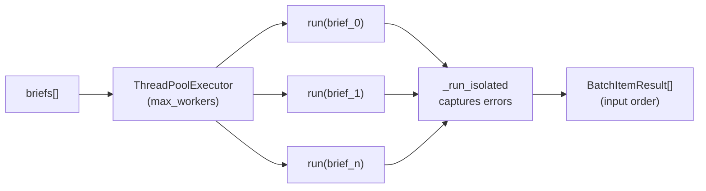
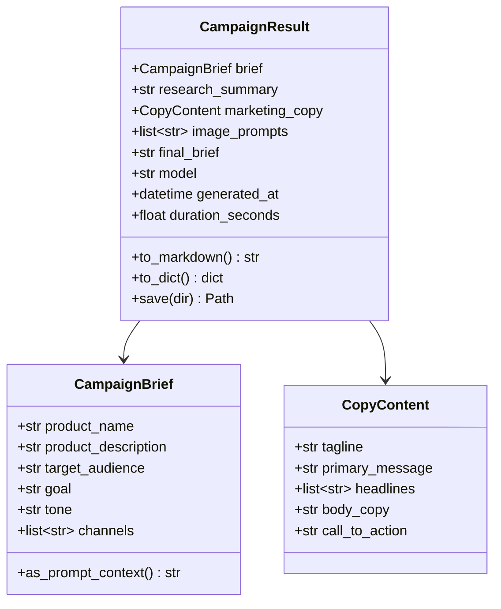

# Architecture and High-Level Design

This document describes the high-level design (HLD) of Campaign Forge: its goals,
components, data flow, and the decisions behind them. It is aimed at engineers
evaluating, extending, or operating the system.

## 1. Purpose and scope

Campaign Forge converts a structured product brief into a complete marketing
campaign by coordinating four specialised LLM agents. It is designed to work in
three modes:

1. As a **command-line application** for one-off or batch generation.
2. As an **embeddable library** inside a larger Python system.
3. As a **batch processor** that fans many briefs across worker threads.

The scope is deliberately narrow: it is a stateless generation pipeline. It does
not own a database, a queue, or a web server. Those concerns are left to the host
system, which keeps the core small, testable, and easy to embed.

## 2. Design goals and principles

| Goal | How it is realised |
| --- | --- |
| Correctness at the boundary | Pydantic models validate every input and structured output. |
| Resilience | Centralised retry/backoff/timeout in one `LLMClient`. |
| Scalability | Stateless pipeline + thread-pool batch with per-item isolation. |
| Testability | Dependency injection of the LLM client; no import-time side effects. |
| Embeddability | Pure library core; configuration is lazy and explicit. |
| Extensibility | Uniform `BaseAgent` contract; provider chosen by base URL. |
| Observability | Structured logging on a dedicated namespace, emitted to stderr. |

Guiding principles:

- **Single responsibility.** Each agent owns exactly one transformation; the
  workflow owns orchestration; the client owns transport and resilience.
- **Fail fast on programmer errors, retry transient ones.** Configuration and
  validation errors surface immediately; only transient transport errors retry.
- **No hidden global state.** Nothing meaningful happens on import; behaviour is
  driven by an explicit `Settings` object.

## 3. System context



Campaign Forge is a client-side component. Its only external dependency at
runtime is an OpenAI-compatible chat-completions endpoint. Configuration and
secrets arrive through the environment; output is written to the local
filesystem (or consumed directly when used as a library).

## 4. Component architecture



### Component responsibilities

| Component | Responsibility | Key collaborators |
| --- | --- | --- |
| `cli.py` | Parse arguments, resolve settings, render results, map errors to exit codes. | `workflow`, `loaders`, `models` |
| `config.py` | Load and validate settings from env / `.env`; resolve the API key lazily. | `pydantic-settings` |
| `models.py` | Define and validate `CampaignBrief`, `CopyContent`, `CampaignResult`. | `pydantic` |
| `llm.py` | Single chat-completion call with retries, backoff, timeout, and logging. | `openai`, `tenacity`, `config` |
| `agents/base.py` | Shared agent contract: identity, LLM access, prompt dispatch. | `llm` |
| `agents/*` | One pipeline stage each: prompt construction and output parsing. | `base`, `parsing`, `models` |
| `parsing.py` | Recover JSON objects and prompt lists from imperfect model text. | (none) |
| `workflow.py` | Sequence agents for one brief; run many briefs concurrently. | `agents`, `models` |
| `loaders.py` | Read and validate briefs from a JSON file. | `models` |
| `logging_config.py` | Configure a Rich handler on the package logger (stderr). | `rich` |
| `exceptions.py` | Typed exception hierarchy for precise error handling. | (none) |

## 5. Runtime flow

### Single campaign



The stages are strictly sequential because each depends on the previous stage's
output. A single campaign therefore makes four model calls.

### Batch

`run_batch()` submits each brief to a `ThreadPoolExecutor`. Threads (not
processes or async) are the right tool here because the work is I/O-bound:
almost all wall-clock time is spent waiting on the network. Each task is wrapped
so that any exception is captured on the result object rather than raised,
guaranteeing that one failure cannot abort the batch. Results are collected as
they complete and then re-sorted into input order.



## 6. Data model



`CampaignBrief` is immutable (frozen) and forbids unknown fields, so it is a safe
contract to pass around. `CopyContent` coerces common model quirks (for example,
a single headline string becomes a one-element list) while still rejecting
genuinely incomplete output.

## 7. Concurrency and scaling

- **Statelessness.** The pipeline holds no mutable shared state between briefs,
  so horizontal scaling is trivial: run more workers, or more processes/hosts.
- **Thread safety.** The `openai` sync client is safe to share across threads. A
  fresh `tenacity` retry controller is created per request, so no retry state is
  shared between concurrent calls.
- **Backpressure.** `max_workers` bounds concurrency. Combined with rate-limit
  backoff, this keeps the system within provider quotas.
- **Throughput ceiling.** For a single provider account the practical limit is
  the provider's tokens-per-minute quota, not CPU. Raising throughput means a
  higher tier, multiple accounts, or a smaller `CF_MAX_TOKENS`.

## 8. Resilience and error handling

The exception hierarchy lets callers catch broadly or precisely:

```text
CampaignForgeError
  |-- ConfigurationError      (missing/invalid settings; fail fast)
  |-- LLMError                (transport failure after retries)
  +-- AgentError
        +-- OutputParsingError  (model output could not be parsed/validated)
```

Resilience is centralised in `LLMClient`:

- **Retries** apply only to transient errors: rate limits, timeouts, connection
  errors, and 5xx. Permanent errors (authentication, bad request) fail fast.
- **Backoff** is exponential with jitter, and honours a server `Retry-After`
  hint (header or message) when present, capped by a maximum delay.
- **Timeout** bounds every request.
- **Empty responses** are treated as failures rather than returned as empty
  strings.

In batch mode, `_run_isolated` converts any exception into a captured error on
the `BatchItemResult`, preserving whole-batch progress.

## 9. Configuration and secrets

- Settings are resolved from constructor arguments, then environment variables,
  then a `.env` file, using `pydantic-settings`.
- The API key is resolved lazily via a property, so importing or constructing
  `Settings` never fails for lack of a key; only an actual model call requires
  one. This keeps the package import-safe for tests and tooling.
- `get_settings()` returns a process-wide cached instance; the CLI derives a
  per-invocation copy with command-line overrides applied.

## 10. Observability

Logging uses a dedicated `campaign_forge` logger namespace with a Rich handler
that writes to **stderr**, keeping stdout clean for data (notably `--json`
output). The library never configures the root logger, so a host application's
logging is untouched until it opts in. Log level is configurable
(`CF_LOG_LEVEL` or `--verbose`).

## 11. Extensibility

- **Add an agent.** Subclass `BaseAgent`, set `name` and `system_prompt`,
  implement `run(...)`, and wire it into `CampaignWorkflow`. The base class
  enforces the contract at class-creation time.
- **Swap the model or provider.** Change `CF_MODEL` and `CF_BASE_URL`. Any
  OpenAI-compatible endpoint works; no code change is required.
- **Change output format.** Extend `CampaignResult` (for example, add a
  `to_html()` or PDF exporter) without touching the agents.

## 12. Testing strategy

The suite is fully offline. A `FakeLLM` that duck-types `LLMClient` returns
deterministic, agent-specific responses, so tests exercise real orchestration
without any network access or API key. Coverage spans:

- model validation and serialisation,
- retry/backoff behaviour and error wrapping (with sleep patched out),
- batch ordering and per-item error isolation,
- lenient parsing of imperfect model output,
- CLI behaviour, exit codes, and stdout/stderr separation.

## 13. Packaging and deployment

- Standard `src/` layout, built with setuptools; the version is single-sourced
  from `campaign_forge.__version__`.
- Installs a `campaign-forge` console entry point; also runnable as
  `python -m campaign_forge`.
- Ships `py.typed` so downstream type-checkers see the annotations.
- CI validates lint, formatting, strict typing, and tests on Python 3.10-3.12.

## 14. Trade-offs and non-goals

- **Sequential per campaign.** The four stages are dependent, so they cannot be
  parallelised within a single campaign; parallelism is across campaigns.
- **Synchronous client.** A sync client with threads is simpler and sufficient
  for I/O-bound batch work; an async client is listed as future work for very
  high fan-out.
- **No persistence or scheduling.** Storage, queuing, and retries-across-restart
  are intentionally left to the host system.

## 15. Future scaling directions

- Async LLM client for higher concurrency at lower thread overhead.
- Pluggable pipeline definition (declarative stages) to support alternative
  workflows without code changes.
- Caching of intermediate results keyed by brief hash to avoid recomputation.
- Optional metrics/tracing hooks for production observability.
